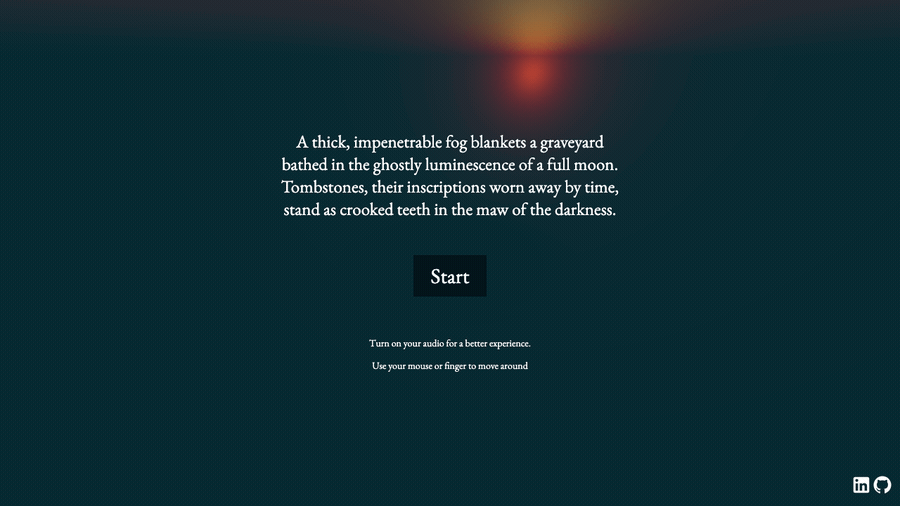

<h1 align="center">🏚️ Haunted House</h1>

<p align="center">A spooky little Three.js scene — a house, a graveyard, drifting ghosts, fog, and fully dynamic shadows, all lit for maximum atmosphere.</p>

<p align="center">
  <a href="https://hunted-house.netlify.app/"></a>
</p>

<p align="center">
  
</p>

<p align="center">
  
  
  
  
</p>

## About

A scene assembled from primitives and textured with PBR materials (color, normal, ambient occlusion, roughness maps) to give the walls, roof, ground, and graves real surface detail.

Highlights:

- 👻 **Animated ghosts** — point lights orbiting the house on sine/cosine paths, each casting its own moving shadows
- 🌫️ **Fog** matched to the background for a seamless night atmosphere
- 💡 **Layered lighting** — ambient + moonlight directional + a warm door light
- 🌑 **Optimized shadows** with tuned shadow-map sizes and camera near/far planes

## Tech

Three.js · WebGL · PBR textures · dynamic shadow mapping · fog · Vite

## Run locally

```bash
npm install   # first time only
npm run dev   # local server at localhost:8080
npm run build # production build in dist/
```

---

<p align="center"><i>Part of my Three.js journey · <a href="https://estebanacuna.dev">estebanacuna.dev</a></i></p>
